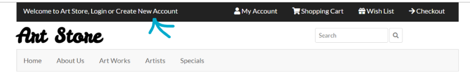
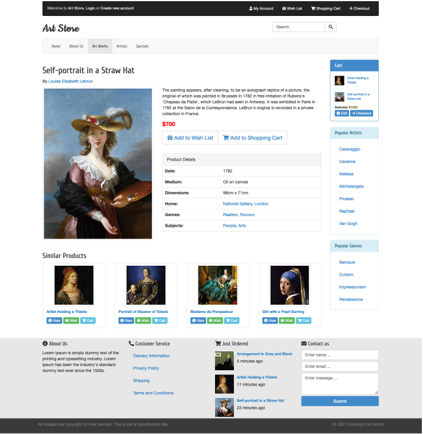
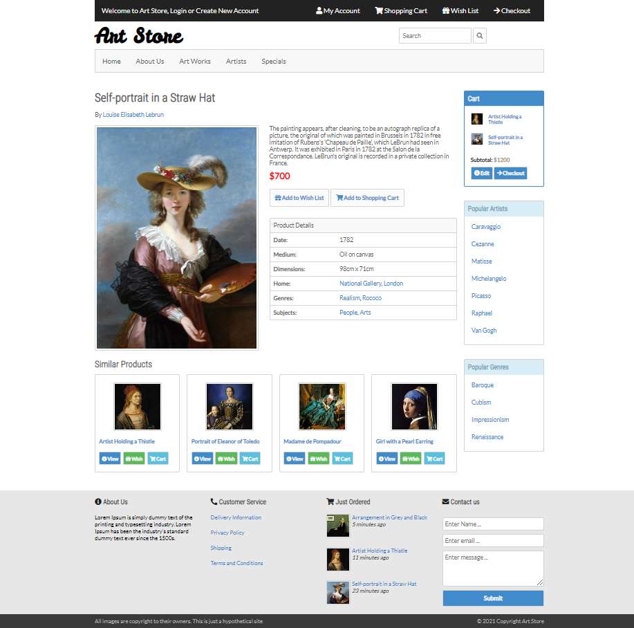
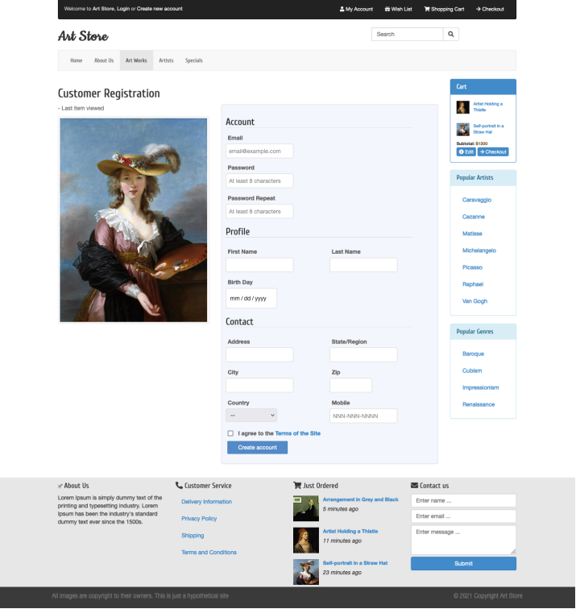
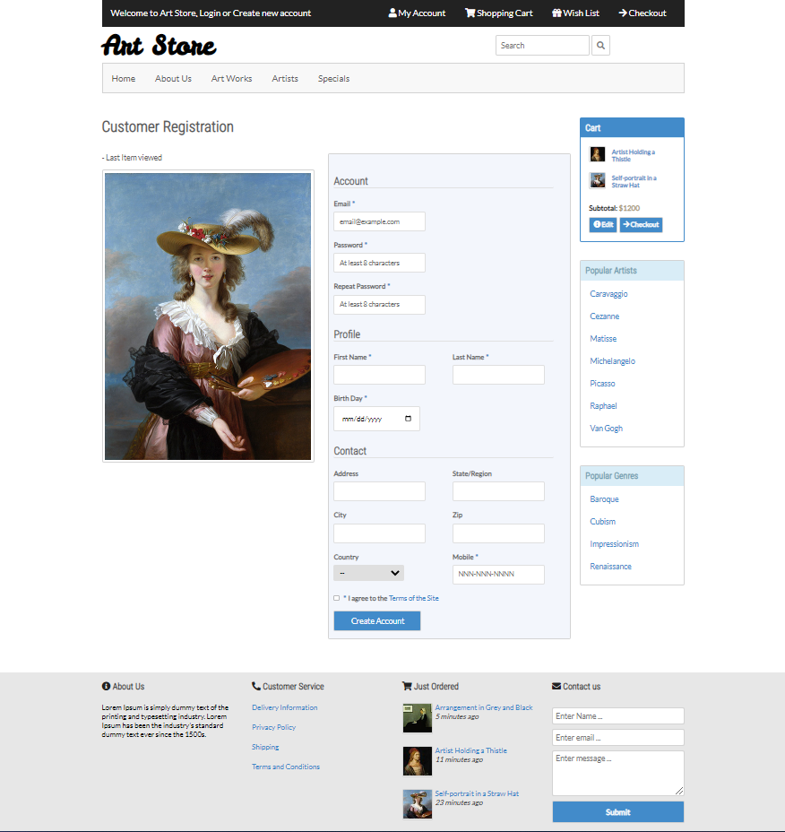

# Page Layout Project
This is a static website, which showcases the css and html skills I have gained in the duration of my studies.
It was for an assignment, where we were given the desktop layout for the pages and we had to recreate them from scratch. 
It was also required to make them responsive for different screen sizes. The responsive layout was for us to design [Link to website](./homepage.html).  

The first page is a sample page of an online store, for a selected product. All links are symbolic. There
is another page that contains a form for new user registration. The form page is also static, there is no
server side programming. In order for the user to navigate to the form page, they have to follow the 
"Create new account" link on main menu's banner.

 

### Desktop Layout

Following, are images of the website. I decided not to make changes in order to modernize the layout, since the goal was to follow a given design. 
However, I tried to make the mobile design more compact and simpler. One can check the responsive layout by following this 
[link](https://aspa7beginner.github.io/web_based/). If they are on desktop they can use dev tools, otherwise, 
if they visit from their phone or tablet, they will be presented with the appropriate layout automatically.

 

Requested product page            |  Designed product page
:-------------------------:|:-------------------------:
  |  

Requested form page            |  Designed form page
:-------------------------:|:-------------------------:
  |  

  

A docker container link with the php code that handles the form's input is in progress and will be provided at a later time.

